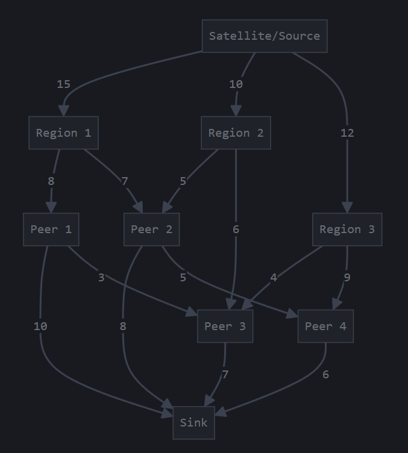

Maximum flow problems involve finding a feasible flow through a flow network that obtains the maximum possible flow rate.

```bash
g++ -o maxflow main.cpp Graph.cpp GraphNode.cpp
.\maxflow.exe
```


